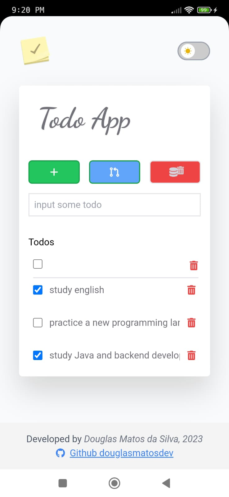
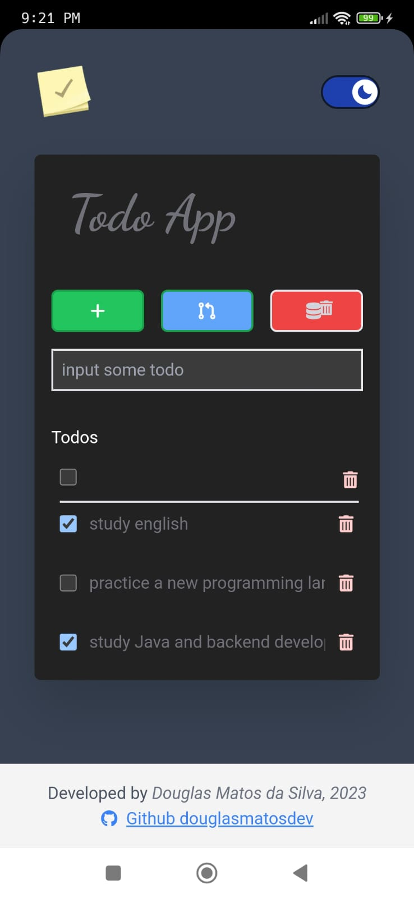
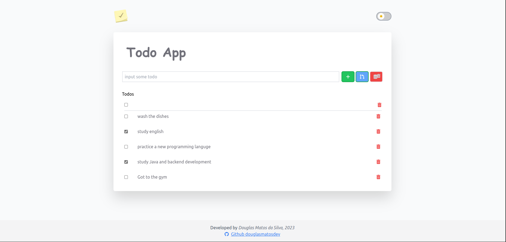
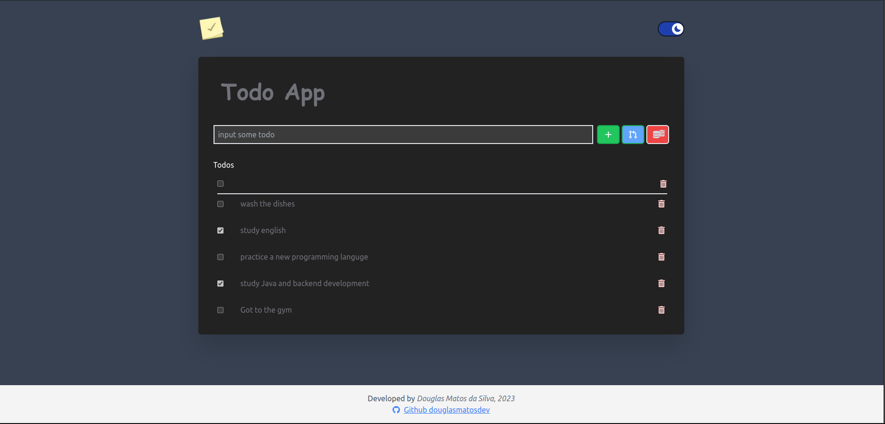

# Todo App

This is a simple todo PWA App.

## Application deployed in Vercel
https://todo-app-without-context-management.vercel.app/

## Installation
```bash
git clone https://github.com/douglasmatosdev/todo-app-without-context-management.git

cd ./todo-app-without-context-management

yarn install
```

## Run in Developement mode
```bash
yarn dev
```

## Build Production mode
```bash
yarn build
```

The data is stored in the browser's database (IndexedDB).

this application is a PWA and can be installed on any smartphone.

## Mobile
| Light | Dark |
|-|-|
| |  |

## Desktop
| Light | Dark |
|-|-|
|  |  |
